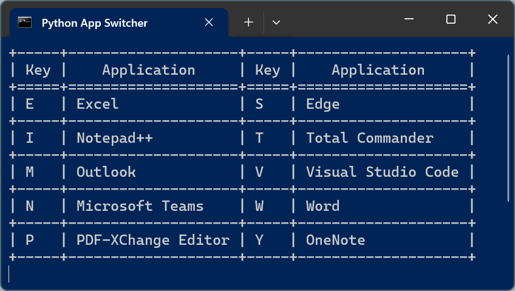

# Windows App Switcher written in Python

Windows App Switcher is a lightweight, keyboard-driven tool that lets you quickly switch between open application windows using custom key bindings. Ideal for power users and developers who want to boost productivity without reaching for the mouse.

Use [AutoHotKey](https://www.autohotkey.com/) or a similar tool to set a hotkey for bringing the App Switcher to the front and than hit a defined key to activate an Application. This is significantly faster than using `ALT`+`TAB`.



## ✨ Features

- Instantly switch between apps using the keyboard
- Displays a terminal table showing current key bindings
- Automatically restores minimized windows
- Fully customizable key-to-window title mappings
- Optional AutoHotKey integration for fast access

## 📦 Requirements

- Windows OS
- Python 3.x
- `pywin32` and `texttable` Python packages

## 🚀 Quick Start

1. Install required packages:

    ```bash
    pip install pywin32 texttable
    ```

3. Cutomize the `KEY_BINDINGS` dictionary in the `app_switcher.py`

2. Run the script:

    ```bash
    python app_switcher.py
    ```

3. Press a key corresponding to a listed application to activate its window

## ⚙️ AutoHotKey Integration (Optional)

To make the switcher easily accessible, you can bind it to a hotkey using AutoHotKey:

```ahk
#SingleInstance force
!Space::
    if WinExist("Python App Switcher")
        WinActivate
return
```

Bind this to any convenient key combination (e.g., ALT+Space).

## 📝 Customization

Modify the `KEY_BINDINGS` dictionary in the script to map keys to application window titles:

```python
KEY_BINDINGS = {
    'E': 'Excel',
    'W': 'Word',
    'T': 'Total Commander',
    ...
}
```

Window titles are matched partially and case-insensitively.
